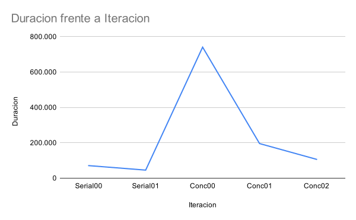
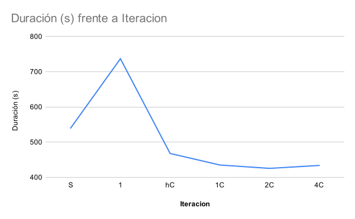

= Reporte de optimizaciones
:toc-title: Tabla de contenidos
:experimental:
:nofooter:
:source-highlighter: pygments
:sectnums:
:stem: latexmath
:toc:
:xrefstyle: short

[[serial_optimizations]]
== Optimizaciones seriales
[%autowidth.stretch,options="header"]
|===
|Iter. |Etiqueta |Duración (s) |_Speedup_ |Descripción corta
|0 |Serial0 |70.909 |1.00 |Versión serial inicial (Tarea01)
|1 |Serial1 |45.551 |1.55 |Uso de array en lugar de matrices
|===

[[serial_iter00]]
=== Versión serial original (Tarea01)
La version serial00 contaba con dos matrices double [rows][columns] para manejar las
temperaturas actuales y las del siguiente estado, lo cual era bastante ineficiente por el tema de accesos a dichas matrices y el cambio de punteros tan grandes.

[[serial_iter01]]
=== Iteración 1

Para la primera iteracion del serial, se reemplazo las dos matrices *double
temperatures[rows][columns]* por un solo array que almacena tanto las
temperaturas actuales como las siguientes. Al cambiar dichas dos matrices
por un solo array que contiene 2*(filas * columnas) celdas, se reduce
drasticamente la sobrecarga de memoria, el acceso a las posiciones y se
aprovechan mejor las capacidades de la memoria cache.

==== Antes :
[source, bash]
----
double ** temperatures
double ** next_temperatures

---------------------------

double** current = malloc(rows * sizeof(double*));
double** next = malloc(rows * sizeof(double*));

for (size_t i = 0; i < rows; i++) {
    temperatures[i] = malloc(columns * sizeof(double));
    next_temperatures[i] = malloc(columns * sizeof(double));
}
----

==== Despues:
[source, bash]
----
double * temperatures
---------------------
double* temperatures = malloc(2 * rows * columns * sizeof(double));
----

[[concurrent_optimizations]]
== Optimizaciones concurrentes (con 4 hilos)

[%autowidth.stretch,options="header"]
|===
|Iter. |Etiqueta |Duración (s) |_Speedup_ |Eficiencia |Descripción corta
|- |SerialI |45.551 |1.00 |--- |Versión serial final
|1 |Conc0 |740.903 |0.06 |1.54% |Versión concurrente inicial (Tarea02)
|2 |Conc01 |195.611 |0.23 |5.82% |Version con barreras para los threads
|3 |Conc02 |106.513 |0.42 |10.69% |Versión con menor control de concurrencia
|3 |Conc02 |208.920 |0.22 |5.45% |Versión con mapeo dinamico
|===

[[conc_iter00]]
=== Versión concurrente inicial (Tarea02)

La version original de Tarea02 tenia un problema muy serio con respecto a la optimizacion, pues creaba y destruia los registros privados y los hilos en cada cambio de estado de la lamina, generando un overhead muy alto

[[conc_iter01]]
=== Iteración 1

La primera optimizacion de la Tarea02 busco disminuir el overhead de la creacion y destruccion de hilos. Dicho proceso se realizaba dentro del while que cambiaba de estado k a estado k+1. Ahora se crean y destruyen los hilos una unica vez, utilizando barreras para el while que itera los estados, reduciendo significativamente el overhead de la creacion y destruccion de hilos, aumentando el rendimiento.

==== Antes:
[source, bash]
----
funcion update_lamina() {
    ...
    ...
    ...
    while (unstable blocks > 0) {
        ...
        ...
        ...
        for (size_t i = 0; i < thread_count; i++) {
            pthread_create(&threads[i], NULL, update_lamina_block,
            &private_data[i]) != 0);
        }
        ...
        ...
        ...
        for (size_t i = 0; i < thread_count; i++) {
            pthread_join(threads[i]);
        }
        ...
        ...
        ...
    }
}
----

==== Despues:
[source, bash]
----
funcion starThreads() {
    ...
    ...
    ...
    for (size_t i = 0; i < thread_count; i++) {
            pthread_create(&threads[i], NULL, update_lamina,
            &private_data[i]) != 0);
    }
    ...
    ...
    ...
    for (size_t i = 0; i < thread_count; i++) {
            pthread_join(threads[i]);
    }
}
funcion update_lamina() {
    while(true) {
        ...
        ...
        ...
        update_lamina_block()
        ...
        ...
        ...
        pthread_barrier_wait(&private_data->public_data->barrier);
    }
}
----

[[conc_iter02]]
=== Iteración 2
Para la ultima optimizacion se observo que existia mucho control de concurrencia
en la primera optimizacion de tarea02, en consecuencia se eliminaron mutexes y
barreras inecesarias.

==== Antes
[source,c]
----
void* update_lamina(void *data) {
    ...
    while (1) {
        ...
        update_lamina_block(lamina, private_data, current_offset, next_offset);
        if (pthread_barrier_wait(&barrier) == PTHREAD_BARRIER_SERIAL_THREAD) {
            ...
            ...
            ...
        }
        pthread_barrier_wait(&barrier);

        pthread_mutex_lock(&can_add_unstable_blocks);
        ...
        ...
        ...
        pthread_mutex_unlock(&can_add_unstable_blocks);

        if (pthread_barrier_wait(&barrier) == PTHREAD_BARRIER_SERIAL_THREAD) {
            ...
            ...
            ...
        }
        pthread_barrier_wait(&barrier);

        pthread_mutex_lock(&can_add_unstable_blocks);
        ...
        ...
        ...
        pthread_mutex_unlock(&can_add_unstable_blocks);

        if (should_stop) break;
    }
    ...
}
----

==== Después: (sin mutexes, con solo dos barreras)

[source,c]
----
void* update_lamina(void *data) {
    ...
    while (1) {
        size_t my_unstable = update_lamina_block(...);

        if (pthread_barrier_wait(&barrier) == PTHREAD_BARRIER_SERIAL_THREAD) {
            ...
            ...
            ...
        }
        pthread_barrier_wait(&barrier);

        __sync_fetch_and_add(&unstable_blocks, my_unstable);

        if (pthread_barrier_wait(&barrier) == PTHREAD_BARRIER_SERIAL_THREAD) {
            ...
            ...
            ...
        }
        pthread_barrier_wait(&barrier);

        if (stop) break;
    }
    ...
}
----

[[conc_iter03]]
=== Iteración 3

Anteriormente se utilizaba mapeo estatico para la asignacion de filas de la lamina, esta iteracion
busco cambiar eso, implementando mapeo dinamico, es decir, en lugar de calcular que filas le corresponden
a cada hilo, ahora la fila pasa a ser procesada por el primer hilo que llegue a reclamarla. Sin embargo,
debido al overhead de la construccion y destruccion de hilos, mas el control de concurrencia con barreras
y con mutex. El rendimiento bajo considerablemente en comparasion con la iteracion02 del concurrente, llegando
a tardar el doble de tiempo.

==== Antes:
[source, bash]
----
# calculo de coordenadas para el recorrido de cada hilo
private_data->x1 = ...
private_data->x2 = ...
private_data->y1 = 0;
private_data->y2 = ...
// recorrido del bloque correspondiente de cada hilo, que ignora los bordes
// pues estos son constantes
for (size_t i = private_data->x1; i < private_data->x2; i++) {
    for (size_t j = private_data->y1; j < private_data->y2; j++) {
        ...
        ...
        ...
        if (i == 0 || i == private_data->public_data->lamina->rows - 1 ||
            j == 0 || j == private_data->public_data->lamina->columns - 1) {
            ...
            ...
            ...
        }
        // reseteamos la temperatura futura de la celda para evitar
        // calculos erroneos
        lamina->temperatures[private_data->next_index] = 0;
            update_cell(lamina, i, j, lamina->temperatures + current_offset,
        lamina->temperatures + next_offset, &private_data->unstable_cells);
    }
}
----

==== Despues:
[source, bash]
----
while (row < rows) {
    pthread_mutex_lock
    row = public_data->next_row;
    public_data->next_row++;
    pthread_mutex_unlock
    if (row < rows) {
        for (size_t j = 0; j < cols; j++) {
            ...
            ...
            ...
            // si la celda actual es el borde, mantenemos la temperatura
            if (row == 0 || row == private_data->public_data->lamina->rows - 1 ||
                j == 0 || j == private_data->public_data->lamina->columns - 1) {
                ...
                ...
                ...
            }
            // reseteamos la temperatura futura de la celda para evitar
            // calculos erroneos
            lamina->temperatures[private_data->next_index] = 0;
                update_cell(lamina, row, j, lamina->temperatures + public_data->current_offset,
            lamina->temperatures + public_data->next_offset, &private_data->unstable_cells);
        }
    }
}
----

[[optimization_comparison]]
=== Comparación de optimizaciones

La versión serial original tomaba 70.909 segundos, mientras que la versión final optimizada reduce ese tiempo a 45.551 segundos gracias al uso de un solo arreglo lineal para las temperaturas. Esta mejora ofrece un speedup de 1.55x.

---

[[concurrency_comparison]]
=== Comparación del grado de concurrencia

En el caso concurrente, la versión inicial (Conc0) presentaba un desempeño muy deficiente con un tiempo de 740.903 segundos, debido a la creación y destrucción de hilos en cada iteración. En la primera mejora (Conc01), los hilos se mantuvieron vivos durante toda la ejecución y se introdujeron barreras para sincronizar las iteraciones, reduciendo el tiempo a 195.611 segundos (speedup ≈ 0.23x).

Finalmente, en la segunda optimización concurrente (Conc02), se eliminaron mutexes y se redujeron las barreras innecesarias, logrando una mayor eficiencia. Esta versión alcanzó un tiempo de 106.513 segundos (speedup ≈ 0.42x). Aunque aún no supera a la versión serial final, representa un avance significativo frente a las versiones concurrentes anteriores.

== Comparativa visual de las optimizaciones

A continuacion se presenta una tabla con multiples pruebas utilizando la primera lamina del job20
[%autowidth.stretch,options="header"]
|===
|Iter. |Etiqueta |Duración (s) |_Speedup_ |Eficiencia |Descripción corta
|1* |S |540.319 |1.00 |100% |Version serial final
|2 |1 |737.040 |0.73 |73.31% |Un solo hilo
|3 |hC |467.901 |1.15 |57.72% |Mitad de hilos de la computadora (2)
|4* |1C |435.095 |1.24 |30.99% |Tantos hilos como CPUs hay en la computadora (4)
|5 |2C |425.520 |1.27 |15.85% |Dos hilos por cada CPU que hay en la computadora (8)
|6 |4C |433.872 |1.24 |7.79% |Cuatro hilos por cada CPU que hay en la computadora (16)
|===

