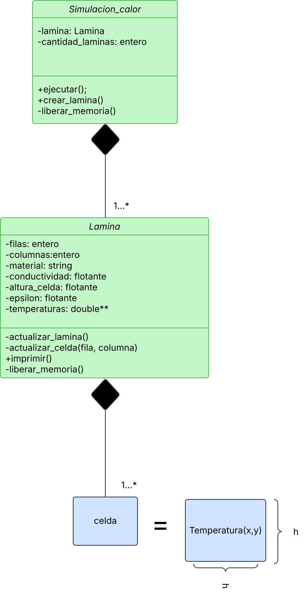

= Transferencia de calor
:experimental:
:nofooter:
:source-highlighter: pygments
:sectnums:
:stem: latexmath
:toc:
:xrefstyle: short

=== Input Example:
[source, bash]
----
[10] [10] [10] [10]
[8]  [0]  [0]  [8]
[6]  [0]  [3]  [6]
[4]  [0]  [0]  [4]
[2]  [0]  [0]  [2]
----

=== Output Example:
[source, bash]
----
[0] [0] [0] [0]
[0] [0] [0] [0]
[0] [0] [3] [0]
[0] [0] [0] [0]
[0] [0] [0] [0]
----

[[design]]
== Design of Solution

=== Pseudocodigos

link:../design/main.pseudo[main_c.pseudo]

link:../design/lamina.h.pseudo[lamina_h.pseudo]

link:../design/lamina.c.pseudo[lamina_c.pseudo]