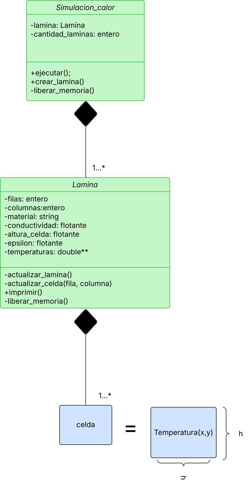

= Transferencia de calor
:experimental:
:nofooter:
:source-highlighter: pygments
:sectnums:
:stem: latexmath
:toc:
:xrefstyle: short


[[problem_description]]
== Problem description
Se debe crear una simulacion que ayude a encontrar el momento de equilibrio termico de una lamina RxC (R numero de columnas y C numero de filas) la cual se le inyecta calor constante por el borde.


Dichas laminas seran matrices donde cada celda almacena una temperatura, la cual cambia segun el estado k y la temperatura de las laminas cercanas (arriba, abajo, izq, der). La temperatura actual sera la suma de las 4 adyacentes.


Dicha celda tambien puede perder temperatura, distribuyendola en las 4 celdas adyacentes. La transferencia depende del area que recorre (tamano de la celda). A mas tiempo pasa, mas calor se transfiere a las celdas adyacentes. La cantidad de energia intercambiada dependera de la calidad conductora de la lamina.


EL programa finaliza en el momento que se haya alcanzado el punto de equilibrio. Esto se calcula a partir de un parametro epsilon, que representara el minimo cambio de temperatura significativo. Si una sola de las celdas tiene un cambio de temperatura mayor a epsilon, la simulacion debe continuar.


La diferencia a comparar con epsilon de cada celda sera la resta del valor en el estado k y el valor en el estado k+1. Donde estado se refiere al estado en el que se encuentra la lamina transcurrido t tiempo Ejemplo:

    * Estado k: estado de la lamina transcurridos 0 minutos.
    * Estado k+1: estado de la lamina transcurridos 20 minutos.


#Si el valor mas grande de toda la lamina es menor a epsilon, el programa finalizara.#


Input example:

[source]
----
include::tests/input001.txt[]
----

Output example:

[source]
----
include::tests/output001.txt[]
----

[[design]]
== Design of solution


#See the link:design/readme.adoc[design/] folder for an overall design of the solution.#


[[user_manual]]
== User manual

[[build]]
=== Build


2. Instalar dependencias:
- Asegúrate de tener instalados todos los paquetes necesarios:
  ```
  make instdeps
  ```

== Guía de Uso
1. Compilar el Proyecto:
- Navega a la carpeta `serial` y compila con `make`:
  ```
  cd serial
  make
  ```


=== Ejecutando el Proyecto
Una vez compilado el proyecto, puedes ejecutarlo usando el siguiente comando:
[source, bash]
---
./bin/serial ./jobs/job###/job###.txt
---

Donde ### es el numero del job a utilizar en el programa, ejemplo:
[source, bash]
---
 ./jobs/job001b/job002.txt
---

[[credits]]
== Credits
Creditos a Jeisson Hidalgo-Céspedes, pues fue quien brindo el make y la guia de como realizar este proyecto.
